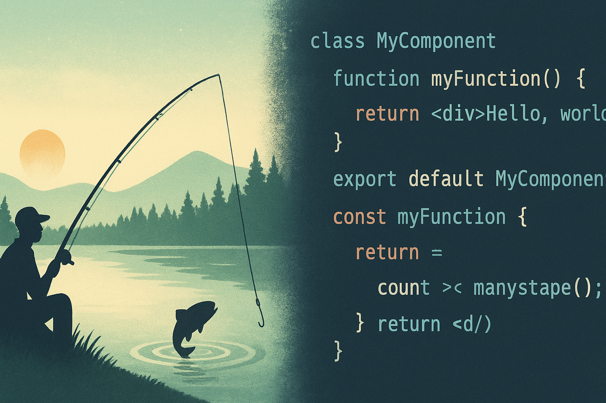

# Olá, eu sou Daniel Schroeder 👋

Desenvolvedor de Software | +15 anos em automação comercial, Delphi, Java, PHP e integração de hardware | Sempre aprendendo

---

## 🚀 O que faço
- 🖥️ Desenvolvimento e manutenção de sistemas em **Delphi + ACBR + SQL Firebird**  
- 📱 Aplicativos Android em **Java**  
- 🌐 Desenvolvimento web e APIs com **PHP e Node.js**  
- ⚡ Integração básica de hardware com **Arduino e microcontroladores (C)**  

---

## 💡 Skills
- **Linguagens:** Delphi, Java, PHP, Node.js, C básico  
- **Banco de dados:** Firebird, SQL  
- **Frameworks/Tools:** ACBR, Spring Boot  
- **Áreas de expertise:** Automação Comercial, PCP, Sistemas Corporativos, Mobile  

---

## 🌱 Aprendizado contínuo
Experiência consolidada em sistemas corporativos e automação, combinada com vontade de aprender e explorar novas tecnologias.

---

## 📫 Contato
- **Email:** schrsistemas@gmail.com  
- **LinkedIn:** [Daniel Schroeder](https://www.linkedin.com/in/schrsistemas/)  
- **WhatsApp:** [+55 47 99736-8457](https://wa.me/5547997368457)

---

## 📊 GitHub Stats

## 🎣 Hobies 

  

